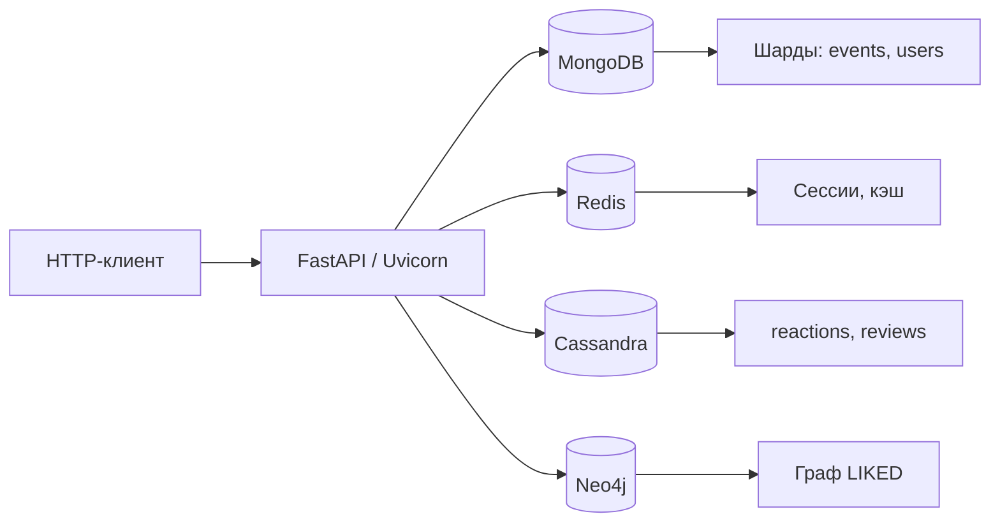
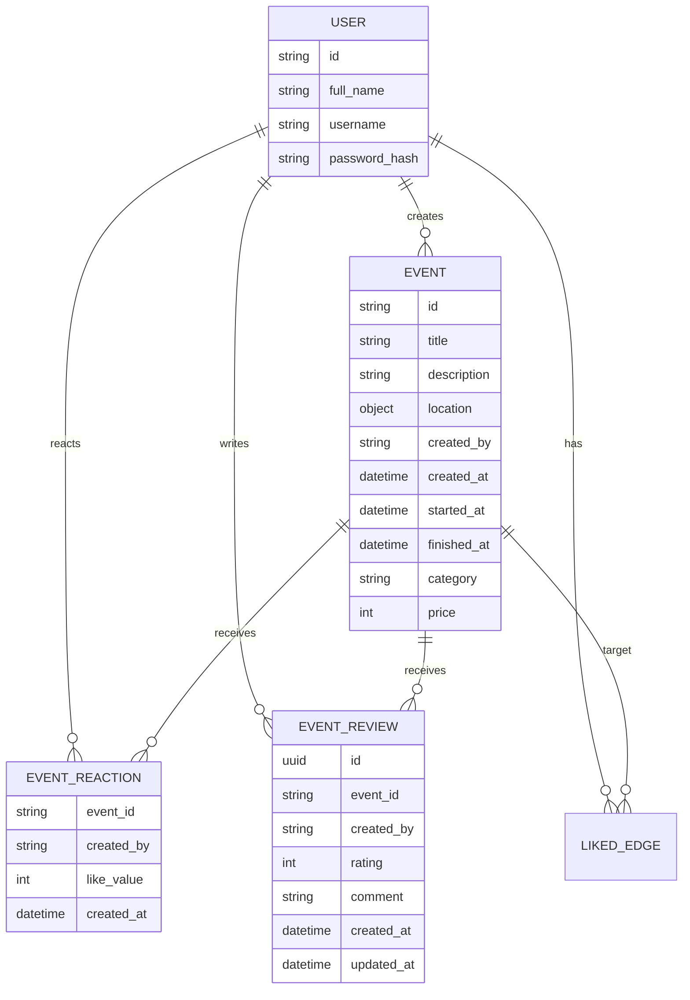

# EventHub


Учебный backend-сервис платформы мероприятий. Позволяет регистрировать пользователей, создавать события, оставлять реакции и отзывы, а также получать рекомендации на основе графа лайков. Проект специально разносит данные по нескольким NoSQL-хранилищам.

## Стек технологий

| Компонент | Технология | Назначение |
|-----------|------------|------------|
| Язык | Python 3.11 | Бизнес-логика |
| Web-фреймворк | FastAPI | HTTP API, автоматическая документация |
| ASGI-сервер | Uvicorn | Запуск приложения |
| Документная БД | MongoDB 7 (шардированный кластер) | Пользователи, события |
| Key-value | Redis 7 | Сессии, кэш реакций, отзывов и рекомендаций |
| Wide-column | Cassandra 4.1 | Реакции (лайки/дизлайки) и отзывы |
| Графовая БД | Neo4j 5 | Граф лайков для рекомендаций |
| Аутентификация | bcrypt | Хеширование паролей |
| Контейнеризация | Docker, Docker Compose | Локальное окружение |
| Управление | Make | Короткие команды для запуска |

## Структура проекта

├── app/
│ └── main.py # FastAPI-приложение, бизнес-логика и работа с БД
├── api/
│ └── eventhub.postman_collection.json # Коллекция запросов для Postman
├── scripts/
│ ├── init-cassandra.cql # Схема таблиц Cassandra
│ ├── init-cassandra.sh # Инициализация keyspace и таблиц
│ ├── init-mongo.sh # Настройка replica set и шардинга MongoDB
│ ├── init-neo4j.sh # Создание ограничений уникальности в Neo4j
│ └── init-shard.sh # Инициализация шардов MongoDB
├── docker-compose.yml # Описание всех сервисов (приложение, базы данных)
├── Dockerfile # Сборка образа Python-приложения
├── Makefile # Команды для запуска и остановки
├── .env.local # Переменные окружения (конфигурация)
├── requirements.txt # Python-зависимости
└── README.md # Документация проекта

## Архитектура



### Основные сущности и связи



**Хранение данных:**
- **MongoDB** – коллекции `users` и `events`. События шардированы по `created_by`.
- **Redis** – сессии (`sid:<id>`), кэш реакций, отзывов и рекомендаций.
- **Cassandra** – таблицы `event_reactions`, `event_reviews`. Первичный ключ включает `event_id`.
- **Neo4j** – узлы `User`, `Event` и связь `LIKED` между ними.

## API

Документация доступна после запуска по адресу [http://localhost:8080/docs](http://localhost:8080/docs).

### Основные эндпоинты

| Метод | Путь | Описание |
|-------|------|----------|
| `GET` | `/health` | Проверка работоспособности |
| `POST` | `/session` | Создать/продлить анонимную сессию |
| `POST` | `/users` | Зарегистрировать пользователя |
| `POST` | `/auth/login` | Войти в систему |
| `POST` | `/auth/logout` | Выйти из системы |
| `POST` | `/events` | Создать событие (авторизован) |
| `GET` | `/events` | Список событий с фильтрами |
| `GET` | `/events/{id}` | Детали события |
| `PATCH` | `/events/{id}` | Изменить категорию/цену/город (организатор) |
| `POST` | `/events/{id}/like` | Поставить лайк (авторизован) |
| `POST` | `/events/{id}/dislike` | Поставить дизлайк (авторизован) |
| `POST` | `/events/{id}/reviews` | Оставить отзыв (авторизован) |
| `GET` | `/events/{id}/reviews` | Список отзывов события |
| `PATCH` | `/events/{id}/reviews/{rid}` | Изменить свой отзыв |
| `GET` | `/recommendations` | Рекомендации событий (авторизован) |
| `GET` | `/users` | Поиск пользователей |
| `GET` | `/users/{id}` | Профиль пользователя |
| `GET` | `/users/{id}/events` | События пользователя |

**Аутентификация** – cookie `X-Session-Id`. Для защищённых маршрутов при отсутствии или истечении сессии возвращается `401`.

**Включение агрегатов** – параметр `include=reactions,reviews` добавляет к каждому событию количество лайков/дизлайков и среднюю оценку отзывов.

### Пример запроса

```bash
curl -X POST http://localhost:8080/users \
  -H 'Content-Type: application/json' \
  -d '{"full_name":"Иван Петров","username":"ivan","password":"secret"}'
```

### Пример ответа с реакциями и отзывами

```json
{
  "events": [
    {
      "id": "665f1f77bcf86cd799439011",
      "title": "Концерт",
      "category": "concert",
      "price": 1500,
      "description": "Вечер живой музыки",
      "location": {"address": "ул. Ленина, 1", "city": "Москва"},
      "created_at": "2026-04-01T10:00:00Z",
      "created_by": "665f1ef7bcf86cd799439010",
      "started_at": "2026-05-01T18:00:00Z",
      "finished_at": "2026-05-01T21:00:00Z",
      "reactions": {"likes": 42, "dislikes": 3},
      "reviews": {"count": 7, "rating": 4.5}
    }
  ],
  "count": 1
}
```

## Запуск

Требования: Docker, Docker Compose, `make`.

1. Склонируйте репозиторий.
2. При необходимости отредактируйте `.env.local`.
3. Выполните `make run`.
4. Проверьте `curl http://localhost:8080/health`.

Остановка: `make stop`. Полная очистка данных: `make clean`.

## Makefile

```makefile
.DEFAULT_GOAL = run

.PHONY: run
run:
	docker compose --env-file .env.local up -d --build

.PHONY: rund
rund:
	docker compose --env-file .env.local up --build

.PHONY: services
services:
	docker compose --env-file .env.local ps

.PHONY: stop
stop:
	docker compose --env-file .env.local down

.PHONY: clean
clean:
	docker compose --env-file .env.local down -v
```

## Конфигурация (.env.local)

| Переменная | Значение по умолчанию | Описание |
|------------|----------------------|----------|
| `APP_HOST` | `0.0.0.0` | Адрес приложения |
| `APP_PORT` | `8080` | Порт HTTP |
| `APP_USER_SESSION_TTL` | `360` | TTL сессии в секундах |
| `APP_LIKE_TTL` | `60` | TTL кэша реакций |
| `APP_EVENT_REVIEWS_TTL` | `120` | TTL кэша отзывов |
| `APP_RECOMMENDATIONS_TTL` | `60` | TTL кэша рекомендаций |
| `REDIS_HOST` | `redis` | Хост Redis |
| `REDIS_PORT` | `6379` | Порт Redis |
| `REDIS_DB` | `0` | Номер БД Redis |
| `CASSANDRA_HOSTS` | `cassandra-test` | Хосты Cassandra |
| `CASSANDRA_PORT` | `9042` | Порт Cassandra |
| `CASSANDRA_KEYSPACE` | `testkeyspace` | Ключевое пространство |
| `CASSANDRA_CONSISTENCY` | `ONE` | Уровень согласованности |
| `MONGODB_HOST` | `mongodb` | Хост MongoDB (mongos) |
| `MONGODB_PORT` | `27017` | Порт mongos |
| `MONGODB_DATABASE` | `eventhub` | База данных |
| `MONGODB_CONFIG_PORT` | `27019` | Порт config-сервера |
| `MONGODB_SHARD_PORT` | `27018` | Порт всех шардов |
| `NEO4J_URL` | `bolt://neo4j:7687` | URL Neo4j |
| `NEO4J_USERNAME` | `neo4j` | Логин |
| `NEO4J_PASSWORD` | `password` | Пароль |
| `NEO4J_HOST` | `neo4j` | Хост для init-скрипта |
| `NEO4J_BOLT_PORT` | `7687` | Порт Bolt |
| `NEO4J_PORT` | `7687` | Порт (запасной) |

## Тестирование

Автоматическая проверка лабораторных работ выполняется в GitHub Actions при каждом push и pull request. Локально можно запустить автотесты командой `python -m pytest` (при наличии тестов).

## Коллекция Postman

Готовая коллекция запросов находится в `api/eventhub.postman_collection.json`. Импортируйте файл в Postman, чтобы быстро протестировать все эндпоинты. Переменные `base_url`, `session_id`, `event_id`, `review_id`, `user_id` настраиваются автоматически в процессе выполнения запросов.

## FAQ

**Q: Почему используется сразу четыре NoSQL-хранилища?**  
A: Это учебный проект по NoSQL. Каждая база отвечает за свой тип данных: MongoDB - документы, Redis - быстрые временные данные, Cassandra - записи по ключу события, Neo4j - граф рекомендаций.

**Q: Почему API хранит сессию в cookie, а не в JWT?**  
A: Сессии на основе cookie позволяют легко управлять временем жизни через Redis, что упрощает инвалидацию и соответствует архитектуре проекта.

**Q: Где найти полный список эндпоинтов и примеры запросов?**  
A: После запуска сервиса откройте встроенную документацию FastAPI по адресу http://localhost:8080/docs. Также доступна готовая коллекция Postman в `api/eventhub.postman_collection.json`.

**Q: Что делать, если контейнеры долго стартуют?**  
A: Некоторые базы данных требуют времени на инициализацию (replica set, healthcheck). Дождитесь сообщений "Cassandra connected" и "Neo4j connected" в логах. Если контейнеры не запускаются, выполните `make clean` и затем `make run`.